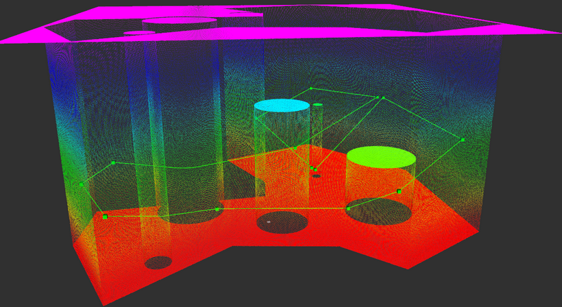
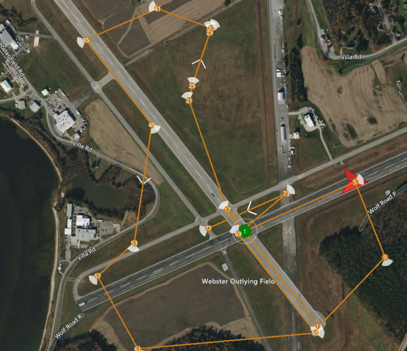
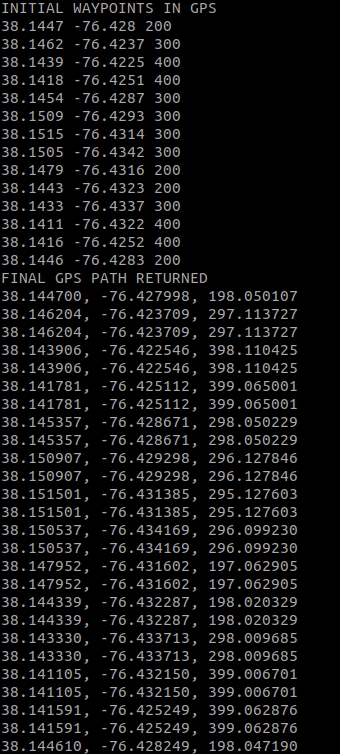

# ENU-ROS Transformations package
An ENU tangential plane ROS Transformations package for navigation stacks and planners utility that solves curvature and ellipsoid behavior-based inaccuracies caused by planning in linearised standard geodetic data.

This package is a geodetic conversion package created for the AUVSI SUAS navigation stack.
It runs various conversions between GPS, ECEF, NED and ENU co-ordinate frames.

This linearises the co-ordinate frame of any arbitrary map or data structure used by a planner while maintaining the appropriate references to geodetic curvature with a return to the first-order model of the earth as being flat. This Local Tangent Plane(LTP) serves as a local reference  direction for representing vehicle attitude and velocity for operation on or near the surface of the earth.

To change the different geodetic systems, functions in [include/transforms/geodetic_conv.h](https://github.com/aaronj0/enu-ros-tf/blob/main/include/transforms/geodetic_conv.h) can be used:

https://github.com/aaronj0/enu-ros-tf/blob/5e9cbfe575797811b82861c3b44c3ea3f59914d6/include/transforms/geodetic_conv.h#L158-L159
https://github.com/aaronj0/enu-ros-tf/blob/5e9cbfe575797811b82861c3b44c3ea3f59914d6/include/transforms/geodetic_conv.h#L75-L76

## Inverse Haversine functionality: 

This package includes an implementation of an Inverse haversine function that provides a GPS/ENU endpoint(as an Eigen Vector2d) given a GPS/ENU start point and a bearing angle clockwise from north.

https://github.com/aaronj0/enu-ros-tf/blob/5e9cbfe575797811b82861c3b44c3ea3f59914d6/include/enu_transforms/enu_transforms.h#L166

## Results:

| ENU Frame local GridMap | GPS Points generated by Path Planner| 
| :---        |    :----:   |
| | 

## 99% GPS<->ENU<->GridMap reconversion accuracy (in feet)

